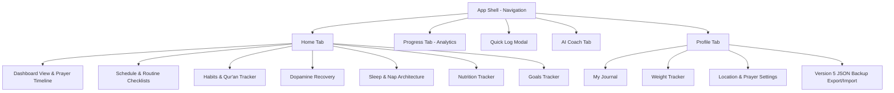

# Recovery+ App Documentation: Complete Functionality & Architecture

Welcome to **Recovery+**, a progressive, offline-first personal wellness, habit-tracking, and spiritual alignment application. Designed as a daily companion, Recovery+ empowers users to build consistency, overcome addictions, track physical health and sleep architecture, log detailed prayers with solar calculations, analyze Deen trends, and gain structured insights through an offline AI coach.

This document details every feature, user requirement, database schema, algorithmic calculation, and workflow implemented across Phase 1, Phase 2, and Phase 3 of the application.

---

## Table of Contents
1. [Core Features & Functionality](#1-core-features--functionality)
2. [Data Architecture (IndexedDB Version 5 Schema)](#2-data-architecture-indexeddb-version-5-schema)
3. [Offline Solar Prayer Calculation Engine](#3-offline-solar-prayer-calculation-engine)
4. [Deen & Recovery Scoring Engines (Algorithmic Logic)](#4-deen--recovery-scoring-engines-algorithmic-logic)
5. [User Workflows & Component Interactions](#5-user-workflows--component-interactions)
6. [UX/UI & Design System](#6-uxui--design-system)
7. [Offline-First Architecture & Portability](#7-offline-first-architecture--portability)

---

## 1. Core Features & Functionality

The application is structured around five global navigation tabs (Home, Progress, Add, Coach, Profile) and dedicated feature views:



### 1.1 Home Tab & Dashboard (`DashboardView`)
* **Dynamic Welcome Greeting**: Personalizes greetings based on the user's name (e.g., *"As-salamu Alaykum, Abdullah 👋"*).
* **Recovery Score Circular Indicator**: An interactive SVG circular progress ring indicating the calculated overall wellness score (clamped between 10 and 100) for the selected day.
* **Dashboard Prayer Timeline Widget**:
  * Displays today's 5 daily solar prayer timings (Fajr, Dhuhr, Asr, Maghrib, Isha).
  * **Active Window Badge**: Live indicator highlighting the active prayer window (e.g. `Active: Dhuhr`).
  * **Next Prayer Countdown**: Real-time timer badge (e.g. `Next: Asr in 3h 3m`).
  * **Visual State Badges**: Color-coded badges for `On Time` (emerald), `Late` (amber), `Missed` (rose), `Window Open` (cyan pulse), `Expired` (slate), and `Upcoming` (slate).
  * **Recorded Completion Timestamps**: Shows exact logged completion times (e.g. `✓ 05:15`).
* **Today's Progress Quick Grid**: Interactive routine task list synced with IndexedDB.

### 1.2 Daily Schedule & Routines (`ScheduleView`)
* **Single-Day Pagination**: Navigate between past, current, and future dates.
* **Detailed Routine Syncing**: Toggling a prayer routine task records `prayed_on_time` with current timestamp; unchecking cleanly resets it to `not_tracked`.

### 1.3 Detailed Prayer Status Logger (`QuickAddModal`)
* **Deen Tab Status Logger**: Select any daily prayer and choose explicit detailed statuses:
  * `prayed_on_time` (100% score value, records completion time).
  * `prayed_late` (50% score value, records completion time).
  * `missed` (0% score value, explicitly logged by user).
  * `not_tracked` (Excluded from scoring, no completion time).
* **Zero Automatic Missed Marking**: Unrecorded expired prayers show visual state `window_expired`, but remain `not_tracked` in the database.

### 1.4 Habits & Qur'an Tracker (`HabitsView`)
* **Habit Categories**: Water, Workout, No Porn, Qur'an Recitation, Study, Walk.
* **Inline Recitation Logger**: Log Qur'an minutes with inline increment/decrement controls. Updates Qur'an activity without overwriting stored prayer logs or calculation context.

### 1.5 Live Deen Analytics (`AnalyticsView`)
* **Date Range Filters**: `7d` (7 days), `30d` (30 days), `90d` (90 days), `1y` (1 year).
* **Live Rate Summary Cards**:
  * **Tracking Coverage %**: Tracked prayers vs Applicable prayers.
  * **On-Time Rate %**: Explicitly on-time prayers vs Tracked prayers.
  * **Late Rate %**: Explicitly late prayers vs Tracked prayers.
  * **Explicitly Missed Rate %**: Explicitly missed prayers vs Tracked prayers.
* **Deen Score History Line Chart**: Visual representation of daily Deen consistency over time.
* **Per-Prayer Breakdown**: Multi-segmented progress bars showing on-time, late, and missed counts for each of the 5 prayers.
* **Qur'an Recitation Trends Bar Chart**: Daily recitation minutes + active days count and average minutes per day.

### 1.6 Sleep & Nap Architecture (`SleepView`)
* **Phase 2 Sleep Tracking**:
  * Bedtime to wake-up duration calculation across midnight.
  * Weighted Sleep Quality score (1–5 scale).
  * Multiple nap logging (start/end times in minutes).
  * Sleep consistency score over 30 days.
  * Automatic warning alerts for sleep durations $> 16$ hours.

### 1.7 Version 5 JSON Backup & Restore (`ProfileView`)
* **Version 5 JSON Export**: Packages entire IndexedDB schema with `version: 5` and `exportedAt` ISO metadata.
* **Lossless Restore**: Imports Version 5 backups as well as legacy Version 1–4 backups. Converts legacy booleans (`true` $\rightarrow$ `prayed_on_time`, `false` $\rightarrow$ `not_tracked`) without fabricating historical context or timestamps.

### 1.8 AI Coach Integration (`CoachView`)
* **Structured Deen AI Context**: Injects structured tracking metrics (Coverage %, On-Time %, Late %, Missed %, Qur'an minutes, Deen goals) into AI Coach prompt context (`getStructuredDeenAIContext`).
* **Non-Judgmental Guidance**: Responds factually to queries regarding Fajr, prayer habits, and Qur'an recitation while preserving all existing health, sleep, and discipline context.

---

## 2. Data Architecture (IndexedDB Version 5 Schema)

Recovery+ uses **Dexie.js** (`RecoveryDB`) for offline IndexedDB storage.

### 2.1 Dexie Version 5 Table Declaration
```typescript
this.version(5).stores({
  userProfile: 'id',
  prayers: '&date',
  dopamineUrges: '++id, timestamp, strength',
  sleep: '&date',
  water: '&date',
  meals: '++id, date, mealType',
  workouts: '++id, date',
  routines: '++id, [date+order], date',
  goals: '++id, category, completed',
  journal: '&date',
  weight: '&date',
  naps: '++id, date',
}).upgrade(async (tx) => {
  await tx.table('prayers').toCollection().modify((log: any) => {
    migrateLegacyPrayerLog(log);
  });
});
```

### 2.2 Core Data Interfaces
```typescript
export type DetailedPrayerStatus =
  | 'prayed_on_time'
  | 'prayed_late'
  | 'missed'
  | 'not_tracked';

export interface PrayerDetail {
  status: DetailedPrayerStatus;
  scheduledTime?: string;
  completedTime?: string;
}

export interface PrayerCalculationContext {
  latitude: number;
  longitude: number;
  timezone: string;
  method: string;
  asrMethod: 'standard' | 'hanafi';
  ishaPolicy: 'midnight' | 'fajr';
}

export interface PrayerLog {
  id?: number;
  date: string; // YYYY-MM-DD
  fajr: PrayerDetail | DetailedPrayerStatus | boolean;
  dhuhr: PrayerDetail | DetailedPrayerStatus | boolean;
  asr: PrayerDetail | DetailedPrayerStatus | boolean;
  maghrib: PrayerDetail | DetailedPrayerStatus | boolean;
  isha: PrayerDetail | DetailedPrayerStatus | boolean;
  quranMinutes: number;
  calculationContext?: PrayerCalculationContext;
}

export interface UserProfile {
  id: number;
  name: string;
  dailyCalorieTarget: number;
  dailyWaterTarget: number;
  dailySleepTarget: number;
  cleanStreak: number;
  dailyScreenTimeTarget?: number;
  latitude?: number;
  longitude?: number;
  city?: string;
  country?: string;
  timezone?: string;
  prayerMethod?: 'karachi' | 'mwl' | 'umm_al_qura' | 'isna';
  asrMethod?: 'standard' | 'hanafi';
  ishaPolicy?: 'midnight' | 'fajr';
}
```

---

## 3. Offline Solar Prayer Calculation Engine

The offline prayer engine ([prayer-engine.ts](file:///c:/Users/SIGMA%20RULER/Desktop/rapp/src/lib/deen/prayer-engine.ts)) computes exact astronomical solar transit times without internet or external API calls:

### 3.1 Astronomical Equations
1. **Solar Declination ($\delta$) & Equation of Time ($EqT$)**: Calculated from Julian Date.
2. **Solar Noon Transit**:
   $$T_{\text{noon}} = 12 + \frac{\text{TimezoneOffset} - \text{Longitude}}{15} - \frac{EqT}{60}$$
3. **Fajr / Isha Hour Angle ($H$)**:
   $$\cos H = \frac{\sin(-\alpha) - \sin\phi \sin\delta}{\cos\phi \cos\delta}$$
   * Karachi ($\alpha_{\text{fajr}} = 18^\circ, \alpha_{\text{isha}} = 18^\circ$)
   * MWL ($\alpha_{\text{fajr}} = 18^\circ, \alpha_{\text{isha}} = 17^\circ$)
   * ISNA ($\alpha_{\text{fajr}} = 15^\circ, \alpha_{\text{isha}} = 15^\circ$)
   * Umm al-Qura ($\alpha_{\text{fajr}} = 18.5^\circ$, Isha = Maghrib + 90 mins)
4. **Asr Hour Angle**:
   $$N = \begin{cases} 1 & \text{Standard (Shafi'i/Maliki/Hanbali)} \\ 2 & \text{Hanafi} \end{cases}$$
   $$\text{Asr Zenith Angle } \theta = \arctan(N + \tan|\phi - \delta|)$$
5. **High-Latitude Safeguard**: If $|\phi| > 48^\circ$ and $\cos H$ produces no real solution, the engine falls back safely to $\frac{\text{NightDuration}}{7}$ proportional offsets.
6. **Timezone DST Safety**: Computes local UTC offset dynamically via `Intl.DateTimeFormat` for the target date and timezone identifier.

---

## 4. Deen & Recovery Scoring Engines (Algorithmic Logic)

### 4.1 Deen Score Formula (`calculateDeenScore`)
Aggregates performance across 3 Deen factors with dynamic weight redistribution when a category is untracked:

$$\text{Deen Score Base Weights}: \text{Prayers } (60\%) + \text{Qur'an } (25\%) + \text{Deen Goals } (15\%)$$

* **Prayer Points Allocation**:
  * `prayed_on_time`: **100%**
  * `prayed_late`: **50%**
  * `missed`: **0%**
  * `not_tracked`, `pending`, `window_expired`: **Excluded from scoring**
* **Dynamic Redistribution**:
  $$\text{Deen Score} = \frac{\sum (\text{Tracked Factor Score} \times \text{Factor Weight})}{\sum \text{Active Tracked Weights}}$$
* **Clamping**: Score is clamped between **10** (floor) and **100** (ceiling). Returns `status: 'insufficient'` if 0 factors are tracked.

### 4.2 Overall Wellness Recovery Score Formula
$$\text{Recovery Score} = (S \times 0.3) + (P \times 0.2) + (D \times 0.15) + (W \times 0.1) + (R \times 0.15) + (N \times 0.1)$$
Where $S$ is Sleep score, $P$ is Deen score, $D$ is Dopamine clean streak score, $W$ is Water score, $R$ is Routine completion score, and $N$ is Nutrition score.

---

## 5. User Workflows & Component Interactions

### 5.1 Routine Toggling Workflow
1. User clicks routine item checkbox in Dashboard or Schedule view.
2. System updates routine task `completed` status in `db.routines`.
3. If task is a prayer (e.g. Fajr), system writes `PrayerDetail` `{ status: 'prayed_on_time', completedTime: '05:15' }` into `db.prayers`.
4. Dashboard SVG score ring and Deen timeline badges update reactively via Dexie `useLiveQuery`.

### 5.2 Backup Export/Import Workflow
1. **Export**: User clicks "Export Backup" in Profile View. System fetches all Dexie tables, appends `version: 5` and ISO timestamp, and triggers JSON download.
2. **Import**: User selects JSON backup file. Importer validates JSON schema, clears existing tables, migrates legacy records losslessly via `migrateLegacyPrayerLog`, inserts records, and reloads client queries.

---

## 6. UX/UI & Design System

* **Canvas Layout**: Deep dark slate canvas (`#03050C`).
* **Glassmorphism Panels**: Semi-transparent containers (`glass-panel`) with subtle borders (`border-slate-900/60`).
* **Semantic Color Palette**:
  * Emerald Green (`#02C39A`): On time prayers, clean streak, target completions.
  * Cyan / Blue (`#3A86FF`): Window open pulse, action buttons, active tab indicators.
  * Amber / Yellow (`#FFB703`): Late prayers, moderate urge levels, warnings.
  * Rose Red (`#E63946`): Explicitly missed prayers, high strength urges.

---

## 7. Offline-First Architecture & Portability

* **100% Offline Capability**: All solar algorithms, score calculations, AI Coach responses, and analytics operate entirely on client-side IndexedDB data.
* **Zero External Network Dependencies**: No third-party API keys or remote servers are required.
* **PWA Readiness**: Service worker caches production bundle assets for standalone desktop and mobile deployment.
