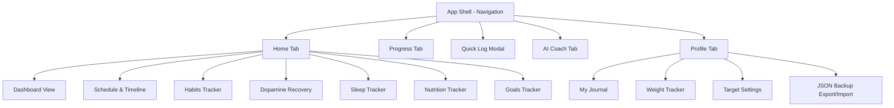

# Recovery+ App Documentation: Complete Functionality & Requirements

Welcome to **Recovery+**, a progressive, offline-first personal wellness, habit-tracking, and spiritual alignment application. Designed as a daily companion, Recovery+ empowers users to build consistency, overcome addictions, track physical health, log prayers, and gain insights through an interactive AI coach.

This document details every feature, user requirement, database schema, algorithmic calculation, and workflow implemented in the application.

---

## Table of Contents
1. [Core Features & Functionality](#1-core-features--functionality)
2. [Data Architecture (IndexedDB Schema)](#2-data-architecture-indexeddb-schema)
3. [The Recovery Score Formula (Algorithmic Logic)](#3-the-recovery-score-formula-algorithmic-logic)
4. [User Workflows & Interactions](#4-user-workflows--interactions)
5. [UX/UI & Aesthetic Design System](#5-uxui--aesthetic-design-system)
6. [Offline PWA & Backup Portability](#6-offline-pwa--backup-portability)

---

## 1. Core Features & Functionality

The application is structured around five primary global navigation tabs (Home, Progress, Add, Coach, and Profile) and several dynamic sub-views:



### 1.1 Home Tab & Dashboard (`DashboardView`)
* **Dynamic Welcome Greeting**: Personalizes greetings based on the user's name (e.g., *"As-salamu Alaykum, Abdullah 👋"*).
* **Recovery Score Circular Indicator**: An interactive SVG circular progress ring indicating the calculated wellness score (from 10 to 100) for the selected day.
* **Streak Indicators**: Displays the current streak (daily logins/habits) and clean recovery days.
* **Today's Progress Quick Grid**: Lists current routine tasks for the day, allowing quick-toggle completion.
* **Bi-directional Sync**: Clicking checkboxes automatically updates the respective database log (e.g., checking "Fajr" updates the `prayers` log, checking "Water" updates the `water` log, checking "Sleep" logs a default 7.5 hr entry, etc.).
* **Goals Preview**: Displays active target summaries.
* **Relapse Check Banner**: A custom banner celebrating clean days (*"No Relapse Today • Alhamdulillah! Clean day saved"*).

### 1.2 Daily Schedule & Timeline (`ScheduleView`)
* **Date Navigation**: Offers single-day pagination controls (Previous/Next day) to log and view history.
* **Two View Options**:
  * **Schedule View**: Standard item checklist.
  * **Timeline View**: A chronological timeline utilizing a vertical tracking line and node states (Prayed, Completed, Pending).

### 1.3 Habits Tracker (`HabitsView`)
* **Sliding Interval Selectors**: Toggle habits tracking view by Daily, Weekly, or Monthly progress.
* **Habits Indicators**:
  * **Drink Water**: Liter progress (Target: 3.0L).
  * **Workout**: Minutes progress (Target: 30m).
  * **No Porn (Dopamine Recovery)**: Link to dopamine recovery dashboard (Target: 90 Days).
  * **Read Qur'an**: Minutes progress (Target: 30m).
  * **Study**: Hours progress (Target: 4.0h).
  * **Walk**: Step count progress (Target: 10,000 steps).
* **Inline Increment Controls**: Allows users to increase or decrease water amount, workout duration, and Quran recitation time directly from the list, auto-checking the daily routine task when targets are hit.

### 1.4 Dopamine Recovery Tracker (`DopamineView`)
* **Clean Shield Badge**: A central visual shield highlighting the clean days streak.
* **Streak Metrics**: Displays urges logged today, longest historical streak, and top triggers.
* **Urge Logger**: Log urges with:
  * **Urge Strength**: Color-coded buttons (`Low` in emerald, `Medium` in yellow, `High` in red).
  * **Active Triggers**: Multi-select tags (Social Media, Loneliness, Stress, Boredom, Late Night, Fatigue).
  * **Custom Notes**: Text input to document situations.
* **Urge Log Timeline**: Lists logged urges chronologically, with quick-delete options.

### 1.5 Sleep Tracker (`SleepView`)
* **Circular Visual Ring**: Shows sleep quality score.
* **Interactive Logger**: Numeric inputs for hours slept, combined with a slider control for sleep quality score (20% to 100%).
* **Sleep Phases Breakdown**: Uses an algorithmic stacked bar displaying Sleep Phase ratios:
  * **Deep Sleep** (28% of total)
  * **Light Sleep** (56% of total)
  * **REM Sleep** (16% of total)
  * **Awake Duration** (randomized fluctuation representing natural awake cycles)
* **Goal Feedback Banner**: Compares logs with targets (e.g., *"Sleep Goal: 8 hrs • You are 0.5 hrs away from your goal"*).

### 1.6 Nutrition Tracker (`NutritionView`)
* **Logged Meals List**: Displays name, type, calorie content, and protein gram values for breakfast, lunch, snacks, and dinner.
* **Add Meal Form**: Tabbed selector for meal type, meal description, calorie input, and protein input.
* **Target Macros Indicators**: Progress bars illustrating current total intake compared to daily targets (Target: 2500 kcal, 120g protein, 3.0L water).

### 1.7 Goals Tracker (`GoalsView`)
* **Target Management**: Categorized into Active and Completed goals.
* **Goal Creator**: Input title, target value, units (e.g. kg, %, books, days), and category (`Health`, `Deen`, `Habits`, `Career`).
* **Progress Adjustments**: Incremental value logging, quick completion, and deletion controls.
* **Vector Aesthetic Card**: High-fidelity mountain graphic representing long-term discipline.

### 1.8 AI Coach Assistant (`CoachView`)
* **Offline AI Advisor**: An interactive chatbot providing wellness logs evaluation using offline database queries.
* **Question Suggestions**: Dynamic suggestion chips (e.g., *"Why was my energy low today?"*, *"I missed Fajr. Help me adjust my day."*).
* **Smart Offline Query Logic**:
  * **Energy/Sleep queries**: Evaluates today's sleep duration, contrasts it with historical average, and offers screen-time reduction or deficit warnings.
  * **Missed Fajr queries**: Recommends morning recovery protocols, alarm repositioning, and Quran recitation adjustments.
  * **Consistency queries**: Analyzes daily routine completion count and highlights anchor habits (Sleep, Fajr, Hydration).
  * **Workout queries**: Suggests skipping high-intensity workouts for active walks if sleep targets weren't met.

### 1.9 Profile, Journal & Data Management (`ProfileView`)
* **PWA Backup Manager**:
  * **Export JSON Backup**: Bundles and downloads the entire IndexedDB data schema into a JSON file named `recovery-backup-YYYY-MM-DD.json`.
  * **Import JSON Backup**: Parses, validates, and imports database logs, reloading the client to rebuild live queries.
* **Weight Tracker**: Logs weight history in kg, syncing with weight-gain/loss goals.
* **Wellness Journal**: Logs text entries alongside a daily mood picker (`great`, `good`, `neutral`, `anxious`).
* **Reset Feature**: Deletes the database schema to reset user configuration and records.

---

## 2. Data Architecture (IndexedDB Schema)

Recovery+ utilizes **Dexie.js** to manage local database schemas securely on the user's browser. The database name is `RecoveryDB`.

### 2.1 Database Tables & Indices

```typescript
this.version(1).stores({
  userProfile: 'id',
  prayers: '&date',
  dopamineUrges: '++id, timestamp, strength',
  sleep: '&date',
  water: '&date',
  meals: '++id, date, mealType',
  workouts: '++id, date',
  routines: '++id, [date+order], date',
  goals: '++id, category, completed',
});
```

### 2.2 Data Interfaces

```typescript
export interface UserProfile {
  id: number;                   // Fixed ID: 1
  name: string;                 // User's name
  age?: number;                 // User's age
  avatarUrl?: string;           // Profile picture link
  dailyCalorieTarget: number;   // Calorie intake target (kcal)
  dailyWaterTarget: number;     // Water intake target (Liters)
  dailySleepTarget: number;     // Sleep duration target (Hours)
  cleanStreak: number;          // Dopamine recovery streak counter
}

export interface PrayerLog {
  id?: number;
  date: string;                 // YYYY-MM-DD
  fajr: boolean;                // Prayer status
  dhuhr: boolean;
  asr: boolean;
  maghrib: boolean;
  isha: boolean;
  quranMinutes: number;         // Quran reading duration in minutes
}

export interface DopamineUrge {
  id?: number;
  timestamp: number;            // Unix timestamp
  strength: 'low' | 'medium' | 'high';
  triggers: string[];           // Selected triggers
  notes?: string;               // Situational description
}

export interface SleepLog {
  id?: number;
  date: string;                 // YYYY-MM-DD
  totalHours: number;           // Sleep duration
  deepHours: number;            // Calculated phase values
  lightHours: number;
  remHours: number;
  awakeHours: number;
  qualityScore: number;         // Quality percentage (1-100)
}

export interface WaterLog {
  id?: number;
  date: string;                 // YYYY-MM-DD
  amountLiters: number;         // Liters consumed
}

export interface MealLog {
  id?: number;
  date: string;                 // YYYY-MM-DD
  mealType: 'breakfast' | 'lunch' | 'snack' | 'dinner';
  description: string;          // Meal details
  calories: number;
  proteinGrams: number;
}

export interface WorkoutLog {
  id?: number;
  date: string;                 // YYYY-MM-DD
  type: string;                 // Exercise label
  durationMinutes: number;
  intensity: 'low' | 'medium' | 'high';
}

export interface RoutineTask {
  id?: number;
  date: string;                 // YYYY-MM-DD
  taskName: string;             // Task name (e.g. "Fajr", "Water", "Sleep")
  timeLabel: string;            // Time/duration indicator
  completed: boolean;           // Completion status
  order: number;                // Sequence order
}

export interface Goal {
  id?: number;
  title: string;                // Goal title
  targetValue: number;
  currentValue: number;
  unit: string;                 // e.g. "kg", "days", "Books"
  category: 'health' | 'deen' | 'habits' | 'career';
  completed: boolean;
  createdAt: number;
}
```

---

## 3. The Recovery Score Formula (Algorithmic Logic)

The **Recovery Score** is computed dynamically on the store whenever metrics change. It aggregates performance across six distinct lifestyle sectors with different weights:

$$\text{Recovery Score} = (S \times 0.3) + (P \times 0.2) + (D \times 0.15) + (W \times 0.1) + (R \times 0.15) + (N \times 0.1)$$

Where the sub-scores are calculated as follows:

| Sector | Weight | Sub-Score Calculation Formula ($S, P, D, W, R, N$) | Default value (unlogged) |
| :--- | :---: | :--- | :---: |
| **Sleep** ($S$) | 30% | $\min\left(\frac{\text{Hours Slept}}{8} \times 100,\, 100\right) \times 0.7 + (\text{Quality Score} \times 0.3)$ | $60\%$ |
| **Deen** ($P$) | 20% | $\frac{\text{Completed Prayers Count}}{5} \times 100$ | $50\%$ |
| **Dopamine** ($D$) | 15% | $\min\left(\frac{\text{Clean Days Streak}}{90} \times 100,\, 100\right)$ | $0\%$ |
| **Hydration** ($W$) | 10% | $\min\left(\frac{\text{Water Consumed (L)}}{3.0} \times 100,\, 100\right)$ | $0\%$ |
| **Routines** ($R$) | 15% | $\frac{\text{Completed Tasks Count}}{\text{Total Routine Tasks Count}} \times 100$ | $50\%$ |
| **Nutrition** ($N$) | 10% | $\frac{\text{Calorie Score} + \text{Protein Score}}{2}$<br>$\text{Calorie Score} = \max\left(0,\, 100 - \left|\frac{\text{Calories} - 2500}{2500}\right| \times 100\right)$<br>$\text{Protein Score} = \min\left(\frac{\text{Protein (g)}}{120} \times 100,\, 100\right)$ | $0\%$ |

*Note: The calculated score is capped to stay between **10** (minimum floor) and **100** (maximum ceiling).*

---

## 4. User Workflows & Interactions

### 4.1 Onboarding Flow
1. **PWAProvider check**: Evaluates whether a user record exists in IndexedDB.
2. **Missing Profile Redirect**: Shows the user settings onboarding screen if no profile is found.
3. **Data collection**: Requests user name, age, weight targets, clean streak, and sleep targets.
4. **Baseline Generation**:
   * Creates initial goals (Gain Weight target, Clean Streak target, Wake up for Fajr, Read 12 Books).
   * Generates a 12-task default routine schedule:
     * *5:05 AM (Fajr), 15 min (Quran), 30 min (Workout), 2.5 Hrs (Study Session 1), 1:15 PM (Dhuhr), 1:45 PM (Lunch), 5:00 PM (Asr), 6:00 PM (Walk), 7:24 PM (Maghrib), 8:41 PM (Isha), Pending (Read Book), 10:30 PM (Sleep).*
5. **Main View unlock**: Transitions into the core application shell.

### 4.2 Logging an Activity
Activities can be logged through three different methods:
1. **Quick-Toggle (Dashboard/Schedule)**: Checking off a routine item immediately updates the database.
2. **Tabbed Tracker Panels**: Entering detailed values (water, workout, meals, sleep, goals) inside their dedicated views.
3. **Quick-Add Drawer (Overlay Modal)**: Triggered from the navigation bar, offering rapid logs for water amounts, sleep quality, meals, or relapse check/urge tracking.

---

## 5. UX/UI & Aesthetic Design System

Recovery+ features a modern design:
* **Background Canvas**: Slate dark layout (`#03050C`) prioritizing readability and low battery consumption.
* **Component Theme (Glassmorphism)**: Uses translucent panels (`glass-panel`) with blur filters, subtle gradients, and dark borders (`border-slate-900/60`).
* **Vibrant Accent Colors**:
  * Action Blue: `#3A86FF` (Focus, main action buttons, active tab indicators).
  * Emerald Green: `#02C39A` (Completed targets, prayers, low strength urges, relapse prevention).
  * Yellow/Amber: `#FFB703` (Energy indicators, meals, medium strength urges).
  * Rose Red: `#E63946` (High strength urges, data removal).
  * Indigo/Purple: Indigo & purple gradients (`bg-indigo-950/20`, `#C77DFF`) highlighting sleep tracking.
* **Visual Vectors**: Uses SVG diagrams and custom responsive charts built on **Recharts** to plot mood, focus, and energy.

---

## 6. Offline PWA & Backup Portability

* **Service Worker Isolation**: Implements `/sw.js` registration on production builds, caching styles, scripts, and layouts for standalone offline execution.
* **Offline IndexedDB Storage**: Keeps user records entirely within browser storage. No cloud connectivity is required.
* **Portability Utilities**: Profile backup controls allow exporting database states to a JSON file and restoring backups.
