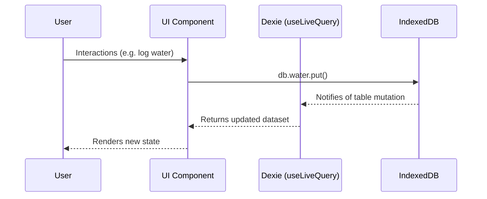
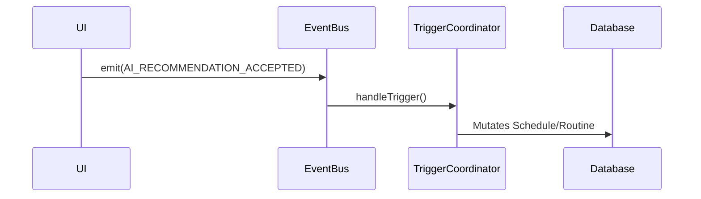

# Data Flow

## Overview
Recovery+ utilizes a unidirectional, reactive data flow entirely within the client boundary. Data moves from the user interface directly into IndexedDB, which triggers reactive re-renders across any subscribed UI components. Complex cross-domain side effects are managed by the Event Bus.

## Standard UI Data Flow

### 1. Read Path (Reactive Rendering)
- Almost all dashboard components subscribe to `IndexedDB` tables using the `useLiveQuery` hook from `dexie-react-hooks`.
- When a table is mutated (by any component), all components querying that table re-render automatically.
- State is NOT duplicated in React context or Redux, ensuring a single source of truth (the database).

### 2. Write Path (Mutations)
- UI components perform direct asynchronous calls to `db.<table_name>.put()` or `add()`.
- Complex multi-table writes (e.g., checking off a prayer routine updates both `db.routines` and `db.prayers`) are encapsulated inside `db.transaction()` blocks to prevent partial writes.

## Event-Driven Flows
For actions that require side effects outside their immediate domain, Recovery+ uses a custom Event Bus (`src/lib/events/event-bus.ts`).

### Example: AI Recommendation Acceptance Flow

### Important Cross-Module Flows
1. **Routine to Prayer Sync:** When a user checks off "Fajr" in the routine list, the `onClick` handler updates the `routines` table, and explicitly updates the `prayers` table to `prayed_on_time`, stamping the completion time.
2. **Routine to Water/Workout Sync:** Checking off "Water" in routines increments the `db.water` log by an assumed amount, keeping the specialized tracking tables synced with the general checklist.
3. **Daily Score Calculation:** The `calculateScoresForDate` function fetches data from 5 different tables (`sleep`, `prayers`, `dopamineUrges`, `water`, `routines`), normalizes them, and outputs a consolidated JSON object used by the Dashboard UI ring.
